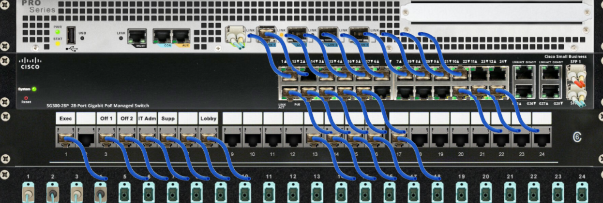
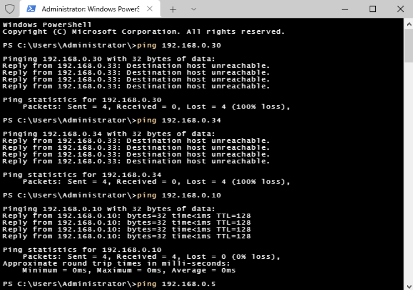
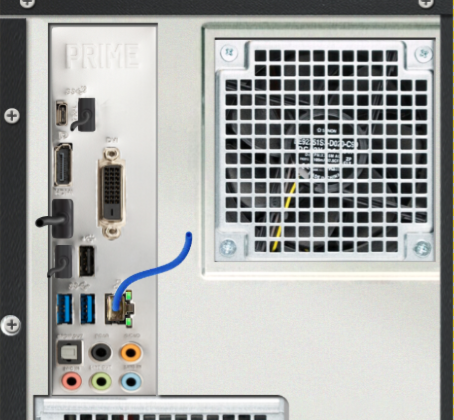
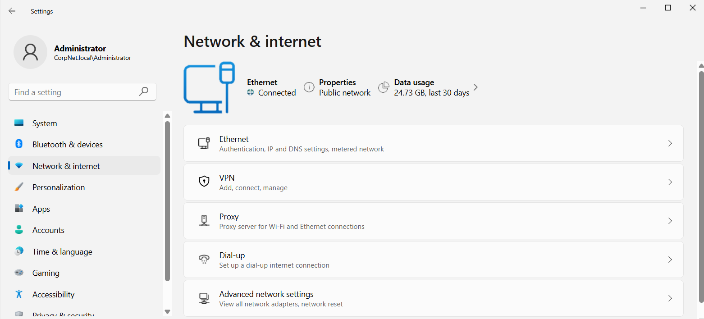
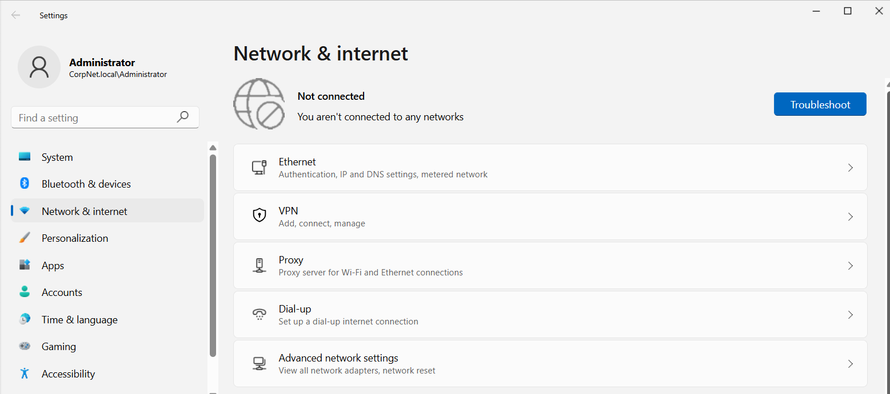
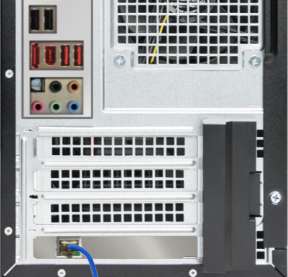
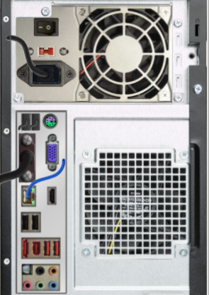
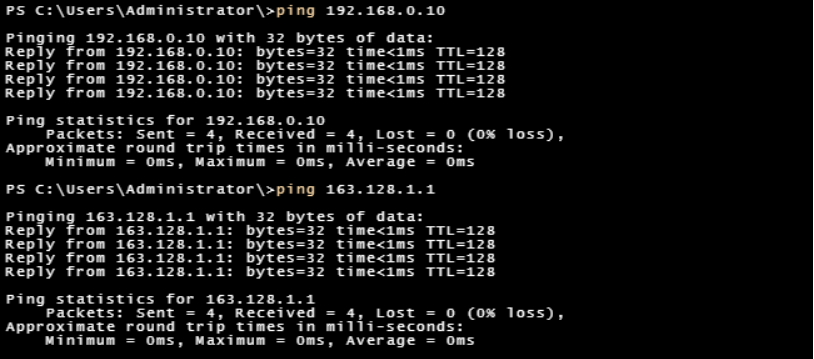
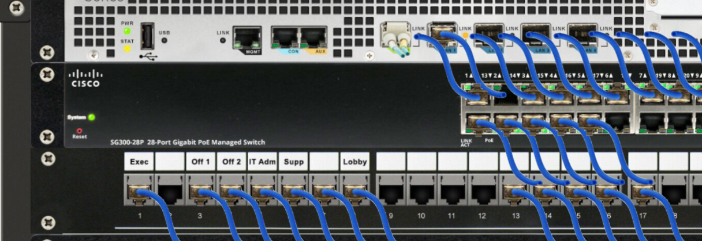

# Troubleshooting Network Communication
## Workstations losing connection to network
### Description
**In this lab two workstations lost connection to the network. The tools I used to resolve was the ping command, verifying the activity network lights on the workstations, and checking the Windows Settings app. I tested a number of theories and implemented solutions.** 

**Step 1: Verify Cisco switch ports**

**Ports 1 and 3 show no blinking lights, therefore no network traffic activity. Trace the ports to the patch panel to identify the specific workstations. The two workstations not connected are the executive and office 1 machines.**

**Step 2: Use Powershell or Command Line on admin workstation and ping each computer on the floor.**

**Using the ping to check all the ip addresses and found two workstations not connected to network. Lost 4 packets, 0 received.**

**Step 3: Verify the admin workstation is connected to the network**

**On the back of the computer check the NIC link and lights to see if traffic is active over the network.**

**Check internet settings by using the Windows Settings app and confirming Ethernet is connected. This machine is connected and working properly. Both the NIC and internet settings confirm it's connected to the network.**

**Step 4: Double check the Exec workstation connectivity**

**On the back of the computer, the NIC link and lights are not blinking showing the traffic is not active over the network.**

**Check Windows Settings app for ethernet internet connection. This machine is not connected. Both the NIC and internet settings confirm it's off the network and not receiving a signal from the switch and router in the network closet. At this point the issue is either from a bad NIC, a defective cable, or cable from the switch/patch panel.**

**Step 5: Test possible bad NIC**

**Changed the cable in the NIC to the onboard ethernet port. The link and blinking lights shows the connection is active.**

**Verify by pinging the admin ip address and server ip address. Both pings were successful - 4 received, 0 lost.**

**Step 6: Check if port 1 on the switch is blinking - Yes**

**Resolution: The Exec workstation had a bad NIC.**

**To find the issue with the Office 1 workstation, repeat steps 4 and 5. There are no possible causes of a faulty NIC or cable on this machine. Try the third possible theory: poor cable on the switch and patch panel.**
**Resolution: Cable was faulty on the switch. Replaced the Cat 6a cable with a new one, connection resumed on the Office 1 workstation.**

